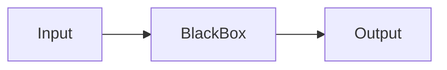

`BlackBox` = Instruction set

---


1. Data and Date Types
2. Variables
3. Operator and Operations
4. Conditions
5. Loops

### other
## another
# 1. Data and Types
video Date
- title - ex: `text: The Complete Dart & Flutter`
- account name `Rivaan `
- subscribe count `60000`
- like count `17k`
- description `text`
- date `text: `
- comments [list of `text`]
---
- text --> String / Char[array]
- number --> 4999 299 2.3
- boolean -->


FB Account:
- Profile {Name, Age, Phone}
- Page {}
- Groups


Comment:
- Username
- comment text
- date
- like count
- replies [....]


```c
int likeCount = 0;

likeCount = likeCount + 1; 
// likeCount += 1;

x = 10;
y = 5;

x /= 3;

// --> add 43 with x variable;
x = x + 43;

x = x / 3;

x /= 3
```